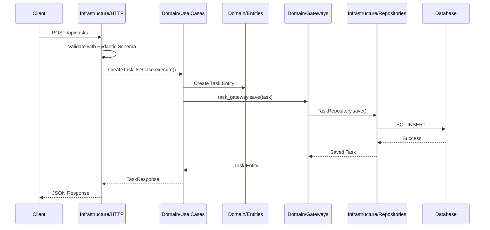

# Detalle de las Capas de la Arquitectura

Este documento profundiza en cada una de las capas que componen el sistema, siguiendo el modelo de **Clean Architecture**. Cada capa tiene un propósito y unas responsabilidades bien definidas.

---

## 1. Capa de Dominio (`domain/`)

**Propósito**: Esta es la capa más interna y el corazón del sistema. Contiene la lógica de negocio pura y las reglas que son fundamentales para la aplicación, independientemente de la tecnología que se utilice.

**Reglas Clave**:
-   No depende de ninguna otra capa.
-   No conoce la base de datos, el framework web ni ninguna otra herramienta externa.
-   Define las políticas y el modelo de datos del negocio.

### Componentes Principales:

-   **Entidades (`domain/entities/`)**: Son los objetos de negocio principales (e.g., `User`, `Task`). Contienen los atributos y la lógica que es intrínseca a ellos. Por ejemplo, una entidad `Task` podría tener un método para marcarse como completada.

-   **Gateways (`domain/gateways/`)**: Son interfaces (contratos) que definen cómo el dominio se comunica con el mundo exterior. Por ejemplo, `TaskGateway` define métodos como `save(task)` o `find_by_id(task_id)`, pero no sabe cómo se implementan. La implementación real se encuentra en la capa de Infraestructura.

-   **Excepciones (`domain/exceptions/`)**: Excepciones personalizadas que representan errores de negocio específicos (e.g., `UserNotFoundError`, `TaskAlreadyCompletedError`).

-   **Enumeraciones (`domain/enums/`)**: Definiciones de estados y tipos del dominio (e.g., `TaskStatus`, `TaskPriority`).

---

## 2. Capa de Casos de Uso (`domain/usecases/`)

**Propósito**: Esta capa contiene la lógica de aplicación que orquesta el flujo de trabajo y ejecuta las operaciones de negocio. Representa las acciones que un usuario puede realizar en el sistema.

**Reglas Clave**:
-   Depende únicamente de la capa de Dominio.
-   No conoce detalles de infraestructura como bases de datos o frameworks web.
-   Orquesta las entidades y gateways para cumplir objetivos de negocio.

### Componentes Principales:

-   **Casos de Uso (`domain/usecases/`)**: Representan las acciones que un usuario puede realizar en el sistema (e.g., `CreateTaskUseCase`, `CompleteTaskUseCase`). Orquestan el flujo de trabajo, utilizando las entidades y los gateways para cumplir con un objetivo de negocio.

### Ejemplo de Caso de Uso:

```python
class CreateTaskUseCase:
    def __init__(self, task_gateway: TaskGateway, user_gateway: UserGateway):
        self.task_gateway = task_gateway
        self.user_gateway = user_gateway
    
    def execute(self, request: CreateTaskRequest) -> TaskResponse:
        # Validar que el usuario existe
        user = self.user_gateway.find_by_id(request.user_id)
        if not user:
            raise UserNotFoundError(f"User {request.user_id} not found")
        
        # Crear la entidad de tarea
        task = Task(
            title=request.title,
            description=request.description,
            user_id=request.user_id,
            priority=request.priority
        )
        
        # Guardar la tarea
        saved_task = self.task_gateway.save(task)
        
        return TaskResponse.from_entity(saved_task)
```

---

## 3. Capa de Coordinación (`application/`)

**Propósito**: Esta capa actúa como punto de entrada y coordinación del sistema. Es responsable de inicializar la aplicación, configurar las dependencias y proporcionar los esquemas de validación.

**Reglas Clave**:
-   Depende de las capas de Dominio y Casos de Uso.
-   No contiene lógica de negocio.
-   Se encarga de la configuración y orquestación del sistema.

### Componentes Principales:

-   **`main.py`**: El punto de entrada principal de la aplicación. Aquí es donde se crea la instancia de Flask y se configuran las rutas.

-   **`container.py`**: El contenedor de inyección de dependencias. Se encarga de construir y proporcionar las implementaciones concretas de los gateways y casos de uso.

-   **Schemas (`application/schemas/`)**: Esquemas de validación de datos (Pydantic) que se utilizan para validar los datos de entrada y salida de la API.

-   **Config (`application/config/`)**: Configuración de la aplicación, variables de entorno y configuración del sistema.

-   **`lambda_handler.py`**: Handler específico para AWS Lambda, adaptando la aplicación para ejecutarse en el entorno serverless.

### Ejemplo de Schema:

```python
class CreateTaskRequest(BaseModel):
    title: str = Field(..., min_length=1, max_length=200)
    description: str = Field(..., min_length=1)
    user_id: int = Field(..., gt=0)
    priority: TaskPriority = TaskPriority.MEDIUM

class TaskResponse(BaseModel):
    task_id: str
    title: str
    description: str
    user_id: int
    status: TaskStatus
    priority: TaskPriority
    created_at: datetime
```

---

## 4. Capa de Infraestructura (`infrastructure/`)

**Propósito**: Esta es la capa más externa. Contiene todos los detalles técnicos y las implementaciones concretas de las interfaces definidas en el dominio.

**Reglas Clave**:
-   Depende de las capas de Dominio y Casos de Uso (para implementar sus interfaces).
-   Es la única capa que conoce los frameworks, las bases de datos y otras herramientas externas.
-   Implementa los adaptadores que conectan el sistema con el mundo exterior.

### Componentes Principales:

-   **Entrypoints (`infrastructure/entrypoints/`)**: Los puntos de entrada al sistema desde el exterior.
    -   `http/`: Controladores de la API REST (rutas de Flask) que reciben peticiones HTTP, las validan y llaman a los casos de uso correspondientes.

-   **Driven Adapters (`infrastructure/driven_adapters/`)**: Implementaciones concretas de los gateways del dominio.
    -   `repositories/`: Repositorios que interactúan con la base de datos. Por ejemplo, `TaskRepository` implementa `TaskGateway` utilizando SQLAlchemy para persistir los datos en MySQL.

-   **Helpers (`infrastructure/helpers/`)**: Clases de utilidad para tareas comunes de infraestructura.
    -   `database/`: Configuración de la conexión a la base de datos y la unidad de trabajo (Unit of Work).
    -   `logger/`: Configuración del sistema de logging.
    -   `errors/`: Manejadores de errores globales.
    -   `middleware/`: Middleware HTTP.

### Ejemplo de Repository:

```python
class TaskRepository(TaskGateway):
    def __init__(self, session: Session):
        self.session = session
    
    def save(self, task: Task) -> Task:
        task_model = TaskModel.from_entity(task)
        self.session.add(task_model)
        self.session.commit()
        return task_model.to_entity()
    
    def find_by_id(self, task_id: str) -> Optional[Task]:
        task_model = self.session.query(TaskModel).filter_by(task_id=task_id).first()
        return task_model.to_entity() if task_model else None
```

---

## Flujo de una Petición

A modo de ejemplo, el flujo de una petición para crear una nueva tarea sería el siguiente:

1.  Una petición `POST` llega al endpoint `/api/tasks` en la capa de **Infraestructura** (`task_routes.py`).

2.  El controlador de la ruta valida los datos de entrada usando un schema de Pydantic de la capa de **Coordinación**.

3.  El controlador obtiene el `CreateTaskUseCase` del contenedor de dependencias (capa de **Coordinación**).

4.  El caso de uso (capa de **Casos de Uso**) utiliza las entidades del **Dominio** para crear una nueva tarea.

5.  El caso de uso utiliza el `TaskGateway` (interfaz del **Dominio**) para guardar la tarea.

6.  La implementación del `TaskRepository` en la capa de **Infraestructura** traduce la entidad del dominio a un modelo de SQLAlchemy y la guarda en la base de datos.

7.  La respuesta viaja de vuelta a través de las capas hasta el cliente.

### Diagrama del Flujo:



---

## Ventajas de Esta Organización

### 🎯 **Separación de Responsabilidades**
- **Dominio**: Lógica de negocio pura
- **Casos de Uso**: Orquestación de operaciones
- **Coordinación**: Punto de entrada y configuración
- **Infraestructura**: Detalles técnicos

### 🔄 **Independencia de Frameworks**
- El dominio y casos de uso no dependen de Flask
- Fácil cambio de framework web
- Fácil cambio de base de datos

### 🧪 **Testabilidad**
- Los casos de uso se pueden probar sin infraestructura
- Mocking sencillo de gateways
- Pruebas unitarias rápidas

### 📈 **Escalabilidad**
- Estructura preparada para crecimiento
- Fácil agregar nuevos casos de uso
- Fácil agregar nuevos adaptadores

---

## Próximos Pasos

Para ver un ejemplo práctico de cómo añadir una nueva funcionalidad siguiendo esta arquitectura, consulta la [Guía de Desarrollo](./development-guide.md). 