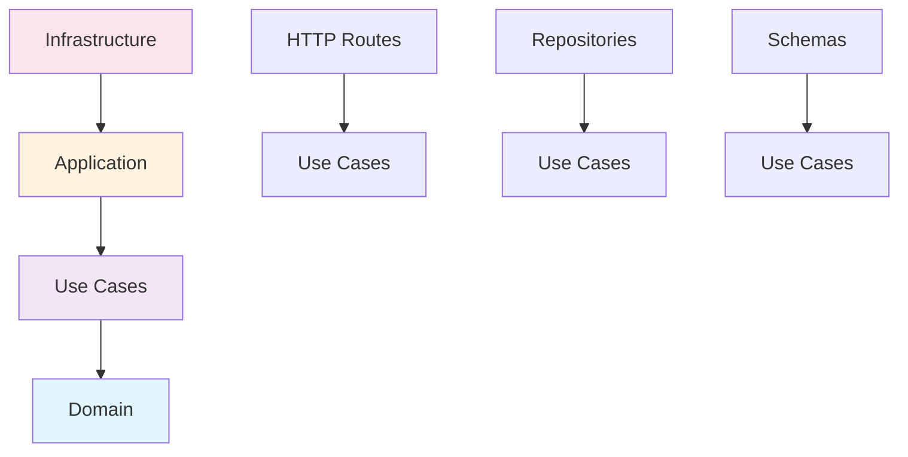

# Arquitectura del Task Manager Contable

Este documento proporciona una visión general de alto nivel de la arquitectura de software utilizada en el **Task Manager Contable**. El sistema está diseñado para gestionar tareas contables de manera eficiente siguiendo principios de Clean Architecture.

## El Modelo de Arquitectura Limpia (Clean Architecture)

Este proyecto se basa en los principios de **Clean Architecture**, popularizados por Robert C. Martin (Uncle Bob). Esta elección no es arbitraria; se hizo para cumplir con objetivos de negocio y técnicos clave:

-   **Independencia del Framework**: El núcleo de la lógica de negocio no depende de frameworks externos como Flask. Esto nos permite cambiar o actualizar el framework con un impacto mínimo en las reglas de negocio.
-   **Capacidad de Prueba (Testability)**: Las reglas de negocio se pueden probar sin necesidad de una base de datos, una interfaz de usuario o cualquier elemento externo. Esto hace que las pruebas sean más rápidas, sencillas y fiables.
-   **Independencia de la Interfaz de Usuario**: La lógica de negocio no se ve afectada por los cambios en la interfaz de usuario (por ejemplo, cambiar de una API REST a una interfaz de línea de comandos).
-   **Independencia de la Base de Datos**: Podemos cambiar de motor de base de datos (por ejemplo, de MySQL a PostgreSQL) sin afectar las reglas de negocio.
-   **Manejo Centralizado de Errores**: Sistema robusto de manejo de errores con códigos HTTP apropiados y logging estructurado.
-   **Validación de Datos**: Validación automática con Pydantic para garantizar la integridad de los datos.

### La Regla de la Dependencia

El principio más importante de Clean Architecture es la **Regla de la Dependencia**. Esta regla establece que las dependencias del código fuente solo pueden apuntar hacia adentro.

```text
+-------------------------------------------------------+
|  Infrastructure (Frameworks, DB, UI)                  |
| +---------------------------------------------------+ |
| |  Use Cases (Application Logic)                    | |
| | +-----------------------------------------------+ | |
| | |  Domain (Entities, Business Rules)            | | |
| | +-----------------------------------------------+ | |
| +---------------------------------------------------+ |
+-------------------------------------------------------+

---------------------> Dependencia <----------------------
```

-   **Círculos Internos**: No saben nada sobre los círculos externos. Por ejemplo, el Dominio no sabe qué base de datos se está utilizando.
-   **Círculos Externos**: Son responsables de implementar los detalles técnicos. Por ejemplo, la capa de Infraestructura implementa los repositorios de la base de datos.

## Estructura de Capas en Este Proyecto

Para implementar Clean Architecture, hemos organizado el sistema en **cuatro capas conceptuales** que se distribuyen en **tres directorios físicos**:

### 🧠 Capas Conceptuales (Clean Architecture)

1.  **Capa de Dominio (`domain/`)**: El núcleo del sistema. Contiene las entidades, las reglas de negocio, las interfaces (gateways) y el sistema de manejo de errores que definen cómo el dominio interactúa con el mundo exterior. Es completamente independiente de cualquier tecnología.

2.  **Capa de Casos de Uso (`domain/usecases/`)**: Contiene la lógica de aplicación (casos de uso) que orquesta el flujo de datos y ejecuta la lógica de negocio. Esta capa depende del Dominio, pero no de la Infraestructura.

3.  **Capa de Infraestructura (`infrastructure/`)**: Contiene todos los detalles técnicos y adaptadores al mundo exterior. Esto incluye la configuración de Flask, los controladores de la API REST, los repositorios de la base de datos, el middleware HTTP y las implementaciones de otros servicios externos.

4.  **Capa de Coordinación (`application/`)**: Punto de entrada y coordinación del sistema. Contiene la configuración de la aplicación, el contenedor de dependencias, los esquemas de validación (Pydantic) y el inicializador de la aplicación.

### 📁 Directorios Físicos

```
accounting_app/
├── domain/           # Capa de dominio + casos de uso
│   ├── entities/     # Entidades de negocio
│   ├── usecases/     # Casos de uso (lógica de aplicación)
│   ├── gateways/     # Interfaces para repositorios
│   ├── exceptions/   # Excepciones de negocio
│   └── enums/        # Enumeraciones de dominio
├── application/      # Punto de entrada y coordinación
│   ├── config/       # Configuración de la aplicación
│   ├── schemas/      # Esquemas de validación (Pydantic)
│   ├── main.py       # Punto de entrada principal
│   ├── container.py  # Inyección de dependencias
│   └── lambda_handler.py  # Handler para AWS Lambda
└── infrastructure/   # Adaptadores y drivers externos
    ├── entrypoints/  # Endpoints HTTP (Flask routes)
    ├── driven_adapters/ # Repositorios y adaptadores
    └── helpers/      # Utilidades (logging, errores, middleware)
```

### 🔄 Flujo de Dependencias



### 📋 Responsabilidades por Capa

#### **Dominio (`domain/`)**
- **Entidades**: Objetos de negocio (Task, User)
- **Reglas de Negocio**: Lógica de validación y transformación
- **Interfaces**: Contratos para repositorios (gateways)
- **Excepciones**: Errores específicos del dominio
- **Casos de Uso**: Orquestación de la lógica de aplicación

#### **Aplicación (`application/`)**
- **Configuración**: Variables de entorno y configuración del sistema
- **Esquemas**: Validación de datos de entrada/salida (Pydantic)
- **Contenedor**: Inyección de dependencias
- **Punto de Entrada**: Inicialización de la aplicación

#### **Infraestructura (`infrastructure/`)**
- **Entrypoints**: Endpoints HTTP y controladores
- **Repositorios**: Implementaciones concretas de acceso a datos
- **Middleware**: Logging, CORS, rate limiting
- **Utilidades**: Helpers y adaptadores externos

### 🎯 Ventajas de Esta Organización

1. **Claridad Conceptual**: Separación clara entre lógica de aplicación (casos de uso) y coordinación (punto de entrada)
2. **Mantenibilidad**: Cada capa tiene responsabilidades bien definidas
3. **Testabilidad**: Los casos de uso se pueden probar independientemente
4. **Flexibilidad**: Fácil cambio de framework o base de datos
5. **Escalabilidad**: Estructura preparada para crecimiento

---

## Próximos Pasos

Para una descripción más detallada de cada una de estas capas y sus responsabilidades, consulta el documento [Detalle de Capas](./layers.md). 