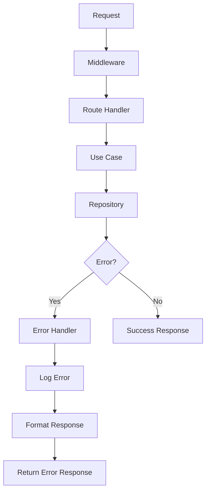

# Sistema de Manejo de Errores

El **Task Manager Contable** implementa un sistema robusto y centralizado de manejo de errores que garantiza respuestas consistentes, logging detallado y debugging eficiente. Este sistema sigue las mejores prácticas empresariales para aplicaciones web.

---

## Arquitectura del Sistema de Errores

### Principios de Diseño

1. **Centralización**: Todos los errores se manejan de forma centralizada
2. **Consistencia**: Respuestas de error uniformes en toda la API
3. **Trazabilidad**: Cada error incluye un identificador único para debugging
4. **Seguridad**: No exponer información sensible en errores de producción
5. **Logging**: Registro estructurado de todos los errores

### Flujo de Manejo de Errores



---

## Tipos de Errores

### 1. Errores de Validación (400 Bad Request)

Errores que ocurren cuando los datos de entrada no cumplen con las reglas de validación.

**Ejemplo de Error:**
```json
{
  "error": {
    "type": "VALIDATION_ERROR",
    "code": "VALIDATION_ERROR",
    "message": "Validation failed for the following fields: title",
    "timestamp": "2025-01-27T13:52:54.418313+00:00",
    "request_id": "1e531181-0961-4825-b251-a524df256614",
    "path": "/api/tasks",
    "method": "POST",
    "details": {
      "field_errors": {
        "title": "Task title cannot be empty or whitespace"
      }
    }
  }
}
```

**Causas Comunes:**
- Campos requeridos faltantes
- Tipos de datos incorrectos
- Validaciones de formato (email, UUID, etc.)
- Restricciones de longitud o rango

### 2. Errores de Recurso No Encontrado (404 Not Found)

Errores que ocurren cuando se solicita un recurso que no existe.

**Ejemplo de Error:**
```json
{
  "error": {
    "type": "RESOURCE_NOT_FOUND",
    "code": "TASK_NOT_FOUND",
    "message": "Task with id '123e4567-e89b-12d3-a456-426614174000' not found",
    "timestamp": "2025-01-27T13:52:54.418313+00:00",
    "request_id": "1e531181-0961-4825-b251-a524df256614",
    "path": "/api/tasks/123e4567-e89b-12d3-a456-426614174000",
    "method": "GET"
  }
}
```

**Causas Comunes:**
- IDs de recursos inexistentes
- URLs malformadas
- Recursos eliminados

### 3. Errores de Reglas de Negocio (422 Unprocessable Entity)

Errores que ocurren cuando la operación viola las reglas de negocio.

**Ejemplo de Error:**
```json
{
  "error": {
    "type": "BUSINESS_RULE_VIOLATION",
    "code": "TASK_ALREADY_COMPLETED",
    "message": "Cannot complete task that is already completed",
    "timestamp": "2025-01-27T13:52:54.418313+00:00",
    "request_id": "1e531181-0961-4825-b251-a524df256614",
    "path": "/api/tasks/123e4567-e89b-12d3-a456-426614174000/complete",
    "method": "PUT"
  }
}
```

**Causas Comunes:**
- Estados de tareas inválidos
- Operaciones no permitidas
- Conflictos de datos

### 4. Errores de Base de Datos (500 Internal Server Error)

Errores que ocurren en la capa de persistencia.

**Ejemplo de Error:**
```json
{
  "error": {
    "type": "DATABASE_ERROR",
    "code": "CONNECTION_ERROR",
    "message": "Unable to connect to database",
    "timestamp": "2025-01-27T13:52:54.418313+00:00",
    "request_id": "1e531181-0961-4825-b251-a524df256614",
    "path": "/api/tasks",
    "method": "GET"
  }
}
```

**Causas Comunes:**
- Problemas de conectividad
- Errores de SQL
- Timeouts de base de datos

### 5. Errores de Rate Limiting (429 Too Many Requests)

Errores que ocurren cuando se excede el límite de peticiones.

**Ejemplo de Error:**
```json
{
  "error": {
    "type": "RATE_LIMIT_EXCEEDED",
    "code": "RATE_LIMIT_EXCEEDED",
    "message": "Too many requests. Please try again later.",
    "timestamp": "2025-01-27T13:52:54.418313+00:00",
    "request_id": "1e531181-0961-4825-b251-a524df256614",
    "path": "/api/tasks",
    "method": "POST",
    "retry_after": 60
  }
}
```

---

## Códigos de Error Estándar

### Códigos de Dominio
| Código | Descripción | Categoría |
| :--- | :--- | :--- |
| `VALIDATION_ERROR` | Error de validación de datos | 400 |
| `RESOURCE_NOT_FOUND` | Recurso no encontrado | 404 |
| `TASK_NOT_FOUND` | Tarea específica no encontrada | 404 |
| `USER_NOT_FOUND` | Usuario específico no encontrado | 404 |
| `BUSINESS_RULE_VIOLATION` | Violación de regla de negocio | 422 |
| `TASK_ALREADY_COMPLETED` | Tarea ya completada | 422 |
| `TASK_ALREADY_CANCELLED` | Tarea ya cancelada | 422 |
| `DATABASE_ERROR` | Error de base de datos | 500 |
| `CONNECTION_ERROR` | Error de conectividad | 500 |
| `RATE_LIMIT_EXCEEDED` | Límite de peticiones excedido | 429 |

### Códigos HTTP Mapeados
| Código HTTP | Descripción | Uso |
| :--- | :--- | :--- |
| `200` | OK | Respuesta exitosa |
| `201` | Created | Recurso creado exitosamente |
| `400` | Bad Request | Error de validación |
| `404` | Not Found | Recurso no encontrado |
| `422` | Unprocessable Entity | Error de regla de negocio |
| `429` | Too Many Requests | Rate limiting |
| `500` | Internal Server Error | Error del servidor |

---

## Implementación del Sistema

### 1. Estructura de Error

```python
@dataclass
class ErrorResponse:
    type: str
    code: str
    message: str
    timestamp: datetime
    request_id: str
    path: str
    method: str
    details: Optional[Dict[str, Any]] = None
```

### 2. Mapeo de Errores

```python
class ErrorMapping:
    """Mapeo centralizado de errores de dominio a respuestas HTTP"""
    
    @staticmethod
    def map_domain_error(error: DomainError) -> Tuple[int, ErrorResponse]:
        """Mapea errores de dominio a respuestas HTTP apropiadas"""
        
        error_mapping = {
            ValidationError: (400, "VALIDATION_ERROR"),
            ResourceNotFoundError: (404, "RESOURCE_NOT_FOUND"),
            BusinessRuleViolationError: (422, "BUSINESS_RULE_VIOLATION"),
            DatabaseError: (500, "DATABASE_ERROR"),
        }
        
        status_code, error_type = error_mapping.get(
            type(error), (500, "INTERNAL_SERVER_ERROR")
        )
        
        return status_code, ErrorResponse(
            type=error_type,
            code=error.code,
            message=str(error),
            timestamp=datetime.utcnow(),
            request_id=get_request_id(),
            path=request.path,
            method=request.method,
            details=error.details if hasattr(error, 'details') else None
        )
```

### 3. Middleware de Manejo de Errores

```python
@app.errorhandler(Exception)
def handle_exception(error):
    """Manejador centralizado de excepciones"""
    
    # Log del error
    logger.error(
        "Unhandled exception",
        exc_info=True,
        extra={
            "request_id": get_request_id(),
            "path": request.path,
            "method": request.method,
            "user_agent": request.headers.get("User-Agent"),
            "ip": request.remote_addr
        }
    )
    
    # Mapeo del error
    if isinstance(error, DomainError):
        status_code, error_response = ErrorMapping.map_domain_error(error)
    else:
        status_code, error_response = 500, ErrorResponse(
            type="INTERNAL_SERVER_ERROR",
            code="INTERNAL_SERVER_ERROR",
            message="An unexpected error occurred",
            timestamp=datetime.utcnow(),
            request_id=get_request_id(),
            path=request.path,
            method=request.method
        )
    
    return jsonify({"error": error_response.__dict__}), status_code
```

---

## Logging de Errores

### Estructura de Log

```python
# Ejemplo de log de error
{
    "timestamp": "2025-01-27T13:52:54.418313+00:00",
    "level": "ERROR",
    "logger": "task_manager",
    "message": "Task not found",
    "request_id": "1e531181-0961-4825-b251-a524df256614",
    "error_code": "TASK_NOT_FOUND",
    "error_type": "RESOURCE_NOT_FOUND",
    "path": "/api/tasks/123e4567-e89b-12d3-a456-426614174000",
    "method": "GET",
    "user_id": "user123",
    "ip": "192.168.1.100",
    "user_agent": "Mozilla/5.0...",
    "stack_trace": "...",
    "context": {
        "task_id": "123e4567-e89b-12d3-a456-426614174000",
        "user_id": "user123"
    }
}
```

### Configuración de Logging

```python
# Configuración de logging estructurado
import structlog

structlog.configure(
    processors=[
        structlog.stdlib.filter_by_level,
        structlog.stdlib.add_logger_name,
        structlog.stdlib.add_log_level,
        structlog.stdlib.PositionalArgumentsFormatter(),
        structlog.processors.TimeStamper(fmt="iso"),
        structlog.processors.StackInfoRenderer(),
        structlog.processors.format_exc_info,
        structlog.processors.UnicodeDecoder(),
        structlog.processors.JSONRenderer()
    ],
    context_class=dict,
    logger_factory=structlog.stdlib.LoggerFactory(),
    wrapper_class=structlog.stdlib.BoundLogger,
    cache_logger_on_first_use=True,
)
```

---

## Mejores Prácticas

### 1. Validación Temprana
```python
# Validar datos de entrada antes de procesar
def create_task(data: CreateTaskRequest) -> TaskResponse:
    # Validación con Pydantic
    validated_data = CreateTaskSchema(**data)
    
    # Procesamiento del caso de uso
    return create_task_use_case.execute(validated_data)
```

### 2. Manejo de Errores Específicos
```python
# Manejar errores específicos en casos de uso
def complete_task(task_id: str) -> TaskResponse:
    try:
        task = task_repository.get_by_id(task_id)
        if not task:
            raise ResourceNotFoundError(f"Task {task_id} not found")
        
        if task.status == TaskStatus.COMPLETED:
            raise BusinessRuleViolationError("Task already completed")
        
        return task_repository.complete_task(task_id)
    except (ResourceNotFoundError, BusinessRuleViolationError):
        raise
    except Exception as e:
        logger.error(f"Unexpected error completing task {task_id}", exc_info=True)
        raise DatabaseError("Failed to complete task")
```

### 3. Logging Contextual
```python
# Agregar contexto relevante a los logs
logger = structlog.get_logger()

def get_user_tasks(user_id: int) -> List[TaskResponse]:
    logger.info(
        "Fetching tasks for user",
        user_id=user_id,
        request_id=get_request_id()
    )
    
    try:
        tasks = task_repository.get_by_user_id(user_id)
        logger.info(
            "Successfully fetched tasks",
            user_id=user_id,
            task_count=len(tasks)
        )
        return tasks
    except Exception as e:
        logger.error(
            "Failed to fetch tasks for user",
            user_id=user_id,
            error=str(e),
            exc_info=True
        )
        raise
```

### 4. Rate Limiting
```python
# Implementar rate limiting para proteger la API
from flask_limiter import Limiter
from flask_limiter.util import get_remote_address

limiter = Limiter(
    app,
    key_func=get_remote_address,
    default_limits=["200 per day", "50 per hour"]
)

@app.route("/api/tasks", methods=["POST"])
@limiter.limit("10 per minute")
def create_task():
    # Implementación del endpoint
    pass
```

---

## Monitoreo y Alertas

### Métricas de Errores
- **Tasa de error**: Porcentaje de peticiones que resultan en error
- **Errores por tipo**: Distribución de errores por categoría
- **Tiempo de respuesta**: Latencia de peticiones exitosas vs. fallidas
- **Errores por endpoint**: Identificar endpoints problemáticos

### Alertas Configuradas
- **Error rate > 5%**: Tasa de error alta
- **500 errors > 10/min**: Errores del servidor frecuentes
- **Database connection errors**: Problemas de conectividad
- **Rate limit exceeded**: Ataques o uso excesivo

---

## Testing de Errores

### Pruebas Unitarias
```python
def test_create_task_validation_error():
    """Test que valida el manejo de errores de validación"""
    
    # Arrange
    invalid_data = {"title": "", "description": "test"}
    
    # Act
    response = client.post("/api/tasks", json=invalid_data)
    
    # Assert
    assert response.status_code == 400
    assert response.json["error"]["type"] == "VALIDATION_ERROR"
    assert "title" in response.json["error"]["details"]["field_errors"]
```

### Pruebas de Integración
```python
def test_task_not_found_error():
    """Test que valida el manejo de recursos no encontrados"""
    
    # Act
    response = client.get("/api/tasks/non-existent-id")
    
    # Assert
    assert response.status_code == 404
    assert response.json["error"]["type"] == "RESOURCE_NOT_FOUND"
    assert response.json["error"]["code"] == "TASK_NOT_FOUND"
```

---

## Debugging en Producción

### Request ID
Cada petición tiene un identificador único que permite rastrear el flujo completo:
```python
def get_request_id() -> str:
    """Genera o recupera el ID único de la petición"""
    if not hasattr(g, 'request_id'):
        g.request_id = str(uuid.uuid4())
    return g.request_id
```

### Logs Estructurados
Los logs incluyen información contextual para facilitar el debugging:
- Request ID para correlación
- Información del usuario
- Parámetros de la petición
- Stack trace completo

### Herramientas de Debugging
- **Logs centralizados**: ELK Stack o similar
- **Métricas en tiempo real**: Prometheus + Grafana
- **Tracing distribuido**: Jaeger o Zipkin
- **Alertas automáticas**: PagerDuty o similar

---

Para más información sobre el desarrollo y testing, consulta la [Guía de Desarrollo](./../architecture/development-guide.md) y la [Estrategia de Pruebas](./testing.md). 